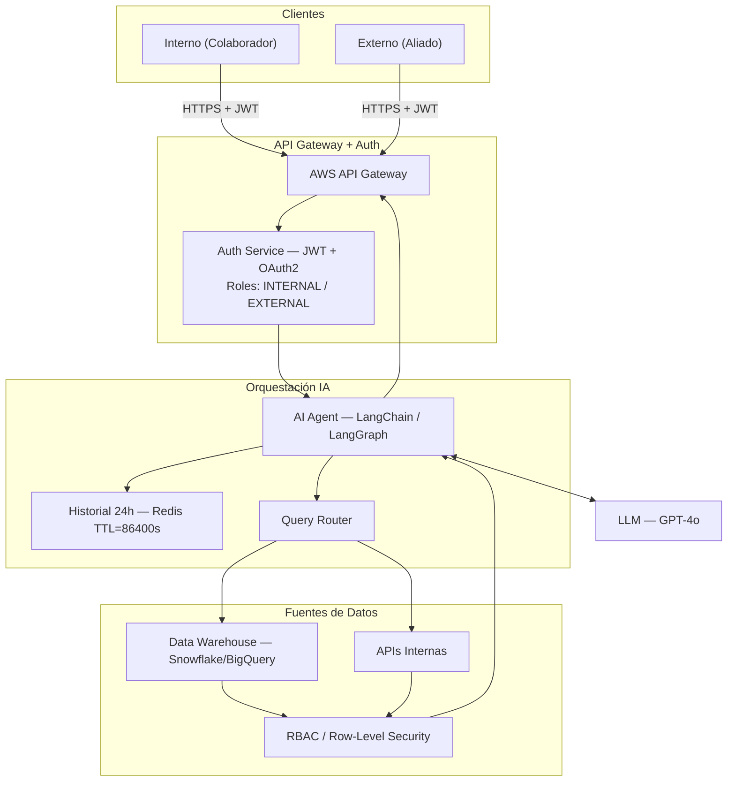
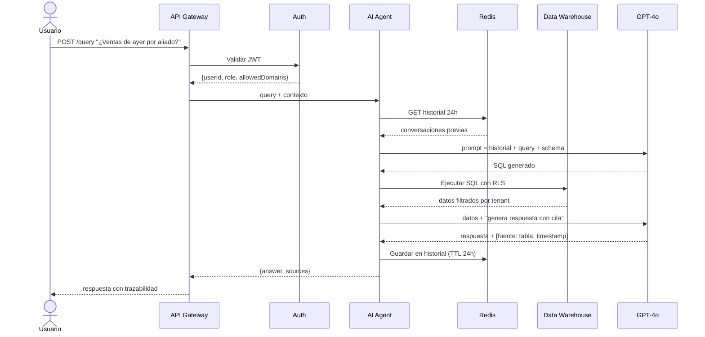

# Arquitectura — Agente IA para Consultas en Lenguaje Natural

## Diagrama de Componentes

## Diagrama de Secuencia

## Tecnologías y Componentes

| Componente | Tecnología | Razón |
|---|---|---|
| Orquestación IA | LangChain / LangGraph | Agentes con memoria, tool-calling y trazabilidad |
| LLM | GPT-4o / modelo privado | Balance costo/calidad |
| Historial | Redis TTL=86400s | Expiración automática 24h, baja latencia |
| Data Warehouse | Snowflake / BigQuery | Row-Level Security nativo, escalable |
| Auth | JWT + OAuth2 | Roles granulares INTERNAL / EXTERNAL |
| Gateway | AWS API Gateway | Rate limiting, WAF, logging centralizado |

## Decisiones de Seguridad

- **Aislamiento de tenants**: Row-Level Security en BD + `tenant_id` obligatorio en cada query
- **Roles**: JWT con claims `role: INTERNAL | EXTERNAL` y `allowedDomains[]`
- **Prompt injection**: sanitización del input antes de enviarlo al LLM
- **Auditoría**: log de cada consulta con `userId`, `timestamp`, `sources_used`
- **Secretos**: AWS Secrets Manager / HashiCorp Vault

## Estrategia de Escalado

- Agente IA stateless → escala horizontal con Kubernetes HPA
- Redis Cluster para alta disponibilidad del historial
- Respuesta en streaming (SSE) para reducir latencia percibida
- Cola SQS para peticiones asíncronas en picos de carga

## Riesgos y Mitigaciones

| Riesgo | Impacto | Mitigación |
|---|---|---|
| Prompt injection | Alto | Sanitización + restricción de tool-calling |
| Fuga entre tenants | Crítico | RLS + tests de aislamiento en CI/CD |
| Alucinaciones del LLM | Medio | Respuestas siempre con cita de fuente |
| Costo descontrolado | Medio | Rate limiting + alertas de presupuesto |
| Latencia alta | Medio | Streaming SSE + timeout con fallback |